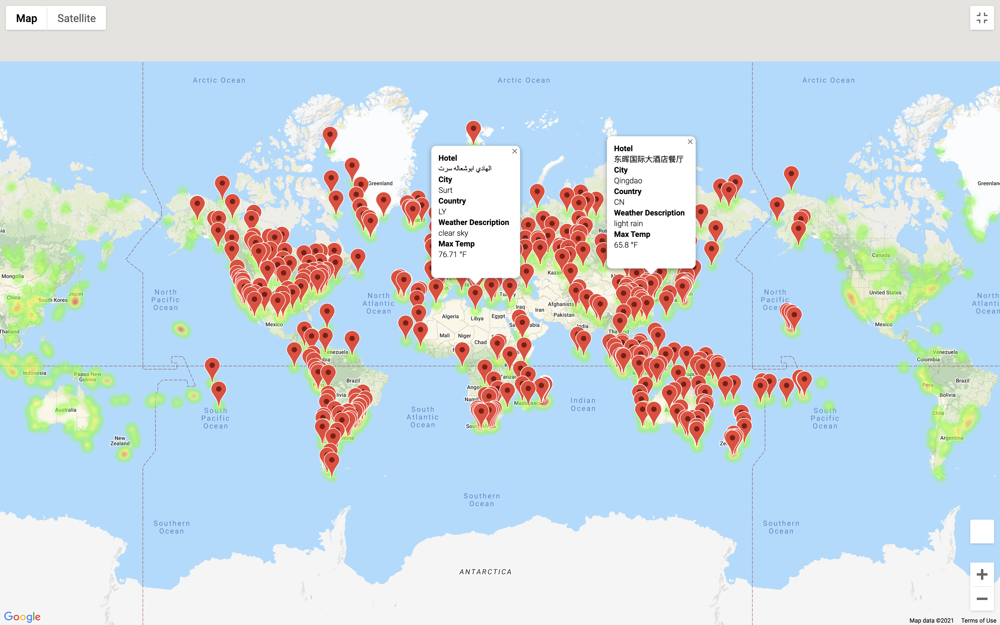

# world-weather-analysis

## Deliverable One:

First, 2000 random latitudes and longitudes were generated and the **citipy** module was used to find nearest cities to each coordinate. A total of 761 unique cities were found.

Next, the openweatherAPI was used to find weather information of each city. OpenweatherAPI was able to find 701 (of the 761 requested) cities and returned responses for those. The relevant weather data was retrieved from each response and through a pandas dataframe, it was dumped to a CSV file eventually. The data is accessible 
[here](Weather_Database/WeatherPy_Database.csv).

## Deliverable Two:

From the 701 cities stored in the first deliverable, the data set was filtered by putting minimum temperature of 30 F and maximum temperature of 80 F. This yielded 488 distinct cities. Then, an attempt to filter rows with empty/null values was made. We did not find any null values. Here, we note that the country code for **Namibia** (**NA**) was incorrectly identified by panda default functions as a NULL value; thus, we used custom logic to identify empty/null values. 

Next, using the Google APIs, the nearest hotel within 5,000 mwters was located. Out of 488, only 445 valid hotels were found; the remaining rows were filtered out. The final output with cities, the corresponding hotels and the weather information is [here](Vacation_Search/WeatherPy_vacation.csv).

Finally, using the Google maps API, a heat map of all locations was generated, along with a tooltip displaying relevant information for each location. This heat map is displayed below.

